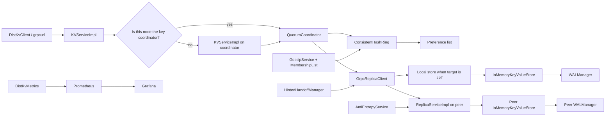

# DistKV Learning Guide: SDE-2 Deep Dive

The project is intentionally Dynamo-style: it favors availability and eventual convergence using consistent hashing, quorum replication, vector clocks, hinted handoff, gossip membership, anti-entropy repair, WAL durability, and operational metrics.

---

## How To Use This Guide

Read it in this order if you are preparing for interviews:

1. Start with the high-level architecture and request flows.
2. Read the data model and quorum sections before the storage section. Storage makes more sense once you understand why values can have sibling versions.
3. Read membership, hinted handoff, and anti-entropy together. They are the availability and repair story.
4. Run the tests after each major topic. The tests are small and are the fastest way to cement the behavior.
5. Use the "SDE-2 Interview Lens" sections to practice explaining trade-offs, limitations, and improvements.

When this guide includes code, the snippet is copied or simplified from the actual project code. Always cross-check the file named above the snippet if you want the exact surrounding context.

---

## Table Of Contents

1. [Project Map](#project-map)
2. [Architecture In One Picture](#architecture-in-one-picture)
3. [Boot Sequence](#boot-sequence)
4. [API And Wire Contract](#api-and-wire-contract)
5. [End-To-End Request Flows](#end-to-end-request-flows)
6. [Routing With Consistent Hashing](#routing-with-consistent-hashing)
7. [Quorum Replication](#quorum-replication)
8. [Versioning, Vector Clocks, Conflicts, And Deletes](#versioning-vector-clocks-conflicts-and-deletes)
9. [Replica RPC Layer](#replica-rpc-layer)
10. [Storage Engine](#storage-engine)
11. [WAL Durability And Recovery](#wal-durability-and-recovery)
12. [Bloom Filter And LRU Eviction](#bloom-filter-and-lru-eviction)
13. [Membership And Failure Detection](#membership-and-failure-detection)
14. [Hinted Handoff](#hinted-handoff)
15. [Anti-Entropy Repair And Merkle Hashing](#anti-entropy-repair-and-merkle-hashing)
16. [Client Library](#client-library)
17. [Observability](#observability)
18. [Deployment And Runtime Configuration](#deployment-and-runtime-configuration)
19. [Testing Strategy](#testing-strategy)
20. [Known Limitations And Design Improvements](#known-limitations-and-design-improvements)
21. [SDE-2 Interview Questions](#sde-2-interview-questions)
22. [Study Plan](#study-plan)

---

## Project Map

The code is organized by distributed-systems responsibility:

| Area | Files | Main responsibility |
| --- | --- | --- |
| Protocol/API | `src/main/proto/kv.proto`, `src/main/java/com/distkv/grpc/*` | Defines gRPC services and translates protobuf messages to Java model objects. |
| Server wiring | `DistKvServer.java` | Reads config, builds ring/store/clients/services, starts gRPC and metrics servers. |
| Routing | `ConsistentHashRing.java`, `NodeEndpoint.java` | Maps keys to replica nodes using a hash ring and virtual nodes. |
| Quorum/replication | `QuorumCoordinator.java`, `ReplicaClient.java`, `GrpcReplicaClient.java`, result records | Fans reads/writes to replicas and decides whether quorum succeeded. |
| Version model | `VersionedValue.java`, `ClockRelation.java` | Carries values, tombstones, timestamps, vector clocks, and conflict comparison logic. |
| Local storage | `InMemoryKeyValueStore.java`, `WALManager.java`, `BloomFilter.java` | Stores versions locally, logs writes, recovers after restart, filters missing keys, evicts LRU keys. |
| Membership | `GossipService.java`, `MembershipList.java`, `GrpcGossipPeerClient.java` | Tracks alive/suspect/dead nodes and removes dead nodes from the ring. |
| Repair | `HintedHandoffManager.java`, `AntiEntropyService.java`, `MerkleTree.java` | Delivers missed writes and periodically syncs divergent replicas. |
| Client | `DistKvClient.java`, `DistKvDemoClient.java` | Simple Java client with retries, health refresh, and demo commands. |
| Observability | `DistKvMetrics.java`, `deploy/*`, `docs/images/*` | Prometheus metrics, Grafana dashboard, Docker Compose demo. |
| Tests | `src/test/java/com/distkv/**` | Unit tests for routing, quorum, storage, WAL, Bloom filter, hinted handoff, and Merkle divergence. |

SDE-2 lens:

- Be able to explain the project as separate planes: request/data plane, membership/control plane, repair plane, and observability plane.
- Be able to identify which classes are pure logic and easy to unit test (`ConsistentHashRing`, `QuorumCalculator`, `BloomFilter`, `MerkleTree`) versus classes that coordinate I/O (`GrpcReplicaClient`, `DistKvServer`, `DistKvClient`).
- Be able to point out implementation limitations. SDE-2 interviews reward accurate trade-off discussion more than pretending a demo system is production-complete.

---

## Architecture In One Picture



The important idea is that any node can receive a client request, but the system still chooses one coordinator per key. The coordinator is the first node in the key's preference list. That coordinator calculates the replica set and fans out internal replica RPCs.

The layers connect like this:

1. `DistKvClient` chooses a healthy node and sends a gRPC request.
2. `KVServiceImpl` checks whether this node is the key's coordinator.
3. If not, it forwards the request to the coordinator node.
4. `QuorumCoordinator` asks `ConsistentHashRing` for the key's preference list.
5. `QuorumCoordinator` uses `ReplicaClient` to read/write all replicas.
6. Each replica applies data through `ReplicaServiceImpl` into `InMemoryKeyValueStore`.
7. `InMemoryKeyValueStore` appends to `WALManager` before mutating memory.
8. `GossipService` updates membership and removes dead nodes from future routing.
9. `HintedHandoffManager` and `AntiEntropyService` repair data after failures.

---

## Boot Sequence

The server starts in `src/main/java/com/distkv/server/DistKvServer.java`. This file is worth reading early because it shows how every component is wired.

### What happens at startup

1. Read environment variables for node id, ports, replication factor, data dir, Bloom filter sizing, WAL compaction, peers, and repair interval.
2. Build the local `NodeEndpoint`.
3. Create a `ConsistentHashRing` and add the local node.
4. Create `WALManager`, `InMemoryKeyValueStore`, and recover from WAL/snapshot.
5. Start Prometheus metrics HTTP server.
6. Create `MembershipList` and add static peers to membership and ring.
7. Create internal replica client, hinted handoff manager, and quorum coordinator.
8. Start gossip and anti-entropy background services.
9. Start gRPC server with `KVService`, `AdminService`, and `ReplicaService`.
10. Announce this node's join to static peers.
11. Start periodic metrics reporting.

Key wiring snippet from `DistKvServer.java`:

```java
ConsistentHashRing ring = new ConsistentHashRing();
ring.addNode(localEndpoint);

WALManager walManager = new WALManager(dataDir.resolve("wal.log"), walCompactionWrites);
InMemoryKeyValueStore store = new InMemoryKeyValueStore(
        clock,
        walManager,
        maxEntries,
        maxMemoryBytes,
        new BloomFilter(bloomExpectedInsertions, bloomFalsePositiveRate));
store.recoverFromWal();

GrpcReplicaClient replicaClient = new GrpcReplicaClient(localEndpoint, store, Duration.ofMillis(500));
HintedHandoffManager hintedHandoffManager = new HintedHandoffManager(replicaClient, Duration.ofSeconds(2));

QuorumCoordinator coordinator = new QuorumCoordinator(
        nodeId,
        ring,
        replicaClient,
        replicationFactor,
        Duration.ofMillis(750),
        clock,
        hintedHandoffManager);
```

Why this matters:

- `WALManager` exists before the store accepts writes, so recovery is part of startup.
- `GrpcReplicaClient` knows the local endpoint and local store. This lets it bypass gRPC when the target replica is the local node.
- `QuorumCoordinator` owns the request-level timeout. The replica client owns per-RPC deadlines.
- Hinted handoff is injected into the coordinator, so only failed write attempts create hints.

SDE-2 lens:

- This is dependency injection by constructors, not a framework. It is easy to test because core classes can be built with fake clocks and local fake clients.
- The server uses Java 21 virtual threads for gRPC handlers:

```java
ExecutorService grpcExecutor = Executors.newVirtualThreadPerTaskExecutor();
Server server = ServerBuilder.forPort(port)
        .executor(grpcExecutor)
        .addService(kvService)
        .addService(new AdminServiceImpl(membershipList, ring))
        .addService(new ReplicaServiceImpl(store))
        .build()
        .start();
```

Virtual threads are a good fit here because request handlers may block on quorum futures, local WAL appends, and blocking gRPC stubs.

---

## API And Wire Contract

The wire contract lives in `src/main/proto/kv.proto`.

### Services

```protobuf
service KVService {
  rpc Get(GetRequest) returns (GetResponse);
  rpc Put(PutRequest) returns (PutResponse);
  rpc Delete(DeleteRequest) returns (DeleteResponse);
  rpc Scan(ScanRequest) returns (stream Entry);
}

service AdminService {
  rpc ClusterStatus(ClusterStatusRequest) returns (ClusterStatusResponse);
  rpc NodeJoin(NodeJoinRequest) returns (NodeJoinResponse);
  rpc NodeLeave(NodeLeaveRequest) returns (NodeLeaveResponse);
}

service ReplicaService {
  rpc Apply(ReplicaApplyRequest) returns (ReplicaApplyResponse);
  rpc ApplyVersions(ReplicaApplyVersionsRequest) returns (ReplicaApplyResponse);
  rpc Read(ReplicaReadRequest) returns (ReplicaReadResponse);
  rpc Merkle(MerkleRequest) returns (MerkleResponse);
  rpc FetchVersions(FetchVersionsRequest) returns (FetchVersionsResponse);
}
```

There are three APIs because the system has three audiences:

- `KVService`: external client operations.
- `AdminService`: cluster membership and status.
- `ReplicaService`: internal node-to-node data replication and repair.

### Value shape

```protobuf
message ValueVersion {
  bytes value = 1;
  int64 timestamp_epoch_ms = 2;
  map<string, int64> vector_clock = 3;
  bool tombstone = 4;
}
```

Every value carries:

- raw bytes, so the system is not tied to strings or JSON;
- timestamp, used as a tiebreaker when vector clocks are equal or concurrent;
- vector clock, used for causality and conflict detection;
- tombstone flag, used for deletes without immediately forgetting older versions.

### Consistency levels

```protobuf
enum ConsistencyLevel {
  ONE = 0;
  QUORUM = 1;
  ALL = 2;
}
```

`Get`, `Put`, `Delete`, and `Scan` carry consistency. In the current implementation, `Get`, `Put`, and `Delete` use it for quorum math. `Scan` carries the field for API symmetry but scans only the contacted node's local store.

### Mapping between protobuf and Java

`src/main/java/com/distkv/grpc/ProtoMappers.java` is intentionally small:

```java
public static ValueVersion toProto(VersionedValue value) {
    return ValueVersion.newBuilder()
            .setValue(ByteString.copyFrom(value.value()))
            .setTimestampEpochMs(value.timestampEpochMs())
            .putAllVectorClock(value.vectorClock())
            .setTombstone(value.tombstone())
            .build();
}

public static VersionedValue fromProto(ValueVersion value) {
    Map<String, Long> vectorClock = new LinkedHashMap<>(value.getVectorClockMap());
    return new VersionedValue(
            value.getValue().toByteArray(),
            value.getTimestampEpochMs(),
            vectorClock,
            value.getTombstone());
}
```

Why use mapper classes:

- Protobuf generated classes are transport objects.
- Java domain records/classes express system logic.
- Keeping conversion explicit avoids spreading protobuf dependencies into every layer.

---

## End-To-End Request Flows

### Put flow

For `put("user:100", value, QUORUM)`:

1. Client chooses a healthy node and calls `KVService/Put`.
2. `KVServiceImpl` checks whether this node is the key coordinator.
3. If not coordinator, it forwards the same request to the key coordinator.
4. Coordinator creates a `VersionedValue` with its node id and local counter.
5. Coordinator asks the ring for the key's replica list.
6. Coordinator sends the write to every replica in the list.
7. Each replica appends to its WAL, merges the version into memory, updates LRU/Bloom state, and maybe compacts WAL.
8. Coordinator counts acknowledgements.
9. If acknowledgements meet the selected consistency level, client gets success.
10. Failed write attempts are stored as hints for later retry.

Forwarding snippet from `KVServiceImpl.java`:

```java
Optional<NodeEndpoint> remoteCoordinator = remoteCoordinatorFor(request.getKey());
if (remoteCoordinator.isPresent()) {
    responseObserver.onNext(forwardStub(remoteCoordinator.get()).put(request));
    responseObserver.onCompleted();
    return;
}

WriteQuorumResult result = record("put", () -> coordinator.put(
        request.getKey(),
        request.getValue().toByteArray(),
        request.getConsistency()));
```

Why forward:

- The client can talk to any healthy node.
- The system still wants a stable coordinator for a key.
- Stable coordination reduces the chance that normal writes to the same key create independent vector-clock branches.

### Get flow

For `get("user:100", QUORUM)`:

1. Client calls any node.
2. Non-coordinator forwards to coordinator.
3. Coordinator asks the ring for replicas.
4. Coordinator sends `ReplicaService/Read` to all replicas.
5. Replica returns all versions it has for that key, including tombstones.
6. Coordinator merges the returned versions using vector clocks.
7. If enough replicas responded, the read succeeds.
8. If the newest merged version is a tombstone, response is `found=false`.
9. If there are multiple visible siblings, response includes all versions and message says conflict.

Read merge in `QuorumCoordinator.java`:

```java
int responses = 0;
List<VersionedValue> mergedVersions = List.of();
long deadline = System.nanoTime() + timeout.toNanos();
for (CompletableFuture<ReplicaReadResult> future : futures) {
    Optional<ReplicaReadResult> result = await(future, deadline);
    if (result.isEmpty() || !result.get().responded()) {
        continue;
    }
    responses++;
    for (VersionedValue version : result.get().versions()) {
        mergedVersions = mergeVersions(mergedVersions, version);
    }
}
```

Important nuance:

- The coordinator sends to all replicas, not only the minimum `R`.
- It uses one shared deadline and then decides whether enough responses arrived.
- It does not perform synchronous read repair. Stale replicas are repaired later by anti-entropy.

### Delete flow

Delete is implemented as a write of a tombstone:

```java
public WriteQuorumResult delete(String key, ConsistencyLevel consistencyLevel) {
    VersionedValue version = VersionedValue.tombstone(
            coordinatorNodeId,
            localCounter.incrementAndGet(),
            clock);
    return write(key, version, consistencyLevel);
}
```

Why tombstones:

- If you physically remove the key immediately, an old replica that missed the delete could later reintroduce the value during repair.
- A tombstone is a version that says "the latest known state is deleted."
- Anti-entropy can replicate tombstones just like values.

Current limitation:

- There is no tombstone garbage collection. A production system would delete tombstones only after it is safe that all replicas have seen them.

### Scan flow

`Scan` is server-side streaming:

```java
localStore.scan(request.getStartKey(), request.getEndKey()).forEach(entry -> responseObserver.onNext(
        Entry.newBuilder()
                .setKey(entry.key())
                .setVersion(ProtoMappers.toProto(entry.value()))
                .build()));
```

Important nuance:

- Scan is local only.
- It does not ask the consistent hash ring for all key ranges.
- It does not merge scan results across replicas.
- For a production distributed scan, you would need token-range ownership, pagination, per-range replica selection, retries, and merge/de-duplication.

---

## Routing With Consistent Hashing

Routing answers one question: for a key, which nodes should store it?

DistKV uses a consistent hash ring in `src/main/java/com/distkv/routing/ConsistentHashRing.java`.

### Why consistent hashing

Naive approach:

```text
nodeIndex = hash(key) % numberOfNodes
```

Problem: when the node count changes, `numberOfNodes` changes, so most keys map to different nodes. That creates huge data movement.

Consistent hashing maps both nodes and keys into a fixed hash space. When a node joins or leaves, only the neighboring ranges move.

### Virtual nodes

Each physical node receives many positions on the ring:

```java
public static final int DEFAULT_VIRTUAL_NODES = 150;

for (int index = 0; index < virtualNodes; index++) {
    BigInteger token = hash(node.nodeId() + "#" + index);
    ring.put(token, node);
    tokens.add(token);
}
```

Why virtual nodes:

- Better distribution than one token per physical node.
- Smaller hot ranges.
- Less skew when a node joins or leaves.
- Easy way to give stronger machines more tokens in a future version.

Trade-off:

- More tokens mean more memory and slightly more ring maintenance work.
- Lookup remains efficient because the ring is a `TreeMap`.

### Preference list lookup

The preference list is the ordered list of replicas for a key. If replication factor is 3, the coordinator wants 3 distinct physical nodes.

Core code:

```java
BigInteger keyHash = hash(key);
List<NodeEndpoint> result = new ArrayList<>(Math.min(replicaCount, physicalNodes.size()));
LinkedHashSet<String> seenPhysicalNodes = new LinkedHashSet<>();

collectDistinctNodes(ring.tailMap(keyHash, true).values(), replicaCount, result, seenPhysicalNodes);
if (result.size() < replicaCount) {
    collectDistinctNodes(ring.headMap(keyHash, false).values(), replicaCount, result, seenPhysicalNodes);
}
return List.copyOf(result);
```

How it works:

1. Hash the key into the same MD5 hash space as node tokens.
2. Walk clockwise from the key hash using `tailMap`.
3. Collect distinct physical nodes, not just tokens.
4. If the end of the ring is reached, wrap to the start with `headMap`.
5. Return at most `min(replicaCount, livePhysicalNodeCount)` nodes.

Why distinct physical nodes:

- A node has 150 virtual tokens.
- Without `seenPhysicalNodes`, the first 3 tokens might all belong to the same physical node.
- Replication would then be fake redundancy.

### Coordinator selection

The first node in the preference list is the coordinator:

```java
public synchronized Optional<NodeEndpoint> getCoordinator(String key) {
    return getPreferenceList(key, 1).stream().findFirst();
}
```

`KVServiceImpl` uses this to forward requests. That gives the project a coordinator pattern without having a central leader.

### SDE-2 interview lens

Be ready to explain these points:

- Consistent hashing reduces remapping on membership changes.
- Virtual nodes reduce imbalance.
- A preference list is different from a coordinator. The coordinator is just the first replica for a key.
- When the ring has fewer live nodes than the configured replication factor, this implementation returns fewer replicas. That improves availability, but quorum math is then calculated over the current replica list size, not the original configured `N`.

---

## Quorum Replication

Quorum replication answers: how many replicas must respond before the operation is considered successful?

The core classes:

- `src/main/java/com/distkv/quorum/QuorumCalculator.java`
- `src/main/java/com/distkv/replication/QuorumCoordinator.java`
- `src/main/java/com/distkv/replication/ReplicaClient.java`

### Consistency math

`QuorumCalculator` maps levels to required responses:

```java
public static int requiredResponses(int replicationFactor, ConsistencyLevel consistencyLevel) {
    if (replicationFactor < 1) {
        throw new IllegalArgumentException("replicationFactor must be positive");
    }
    return switch (consistencyLevel) {
        case ONE, UNRECOGNIZED -> 1;
        case QUORUM -> (replicationFactor / 2) + 1;
        case ALL -> replicationFactor;
    };
}
```

For 3 replicas:

| Level | Required responses | Latency | Availability | Staleness risk |
| --- | ---: | --- | --- | --- |
| ONE | 1 | Lowest | Highest | Highest |
| QUORUM | 2 | Medium | Medium | Lower |
| ALL | 3 | Highest | Lowest | Lowest |

Classic quorum property:

```text
R + W > N
```

If read quorum `R` and write quorum `W` overlap, at least one node read by the read operation must have acknowledged the latest successful write.

Important nuance for this project:

```java
List<NodeEndpoint> replicas = replicasFor(key);
int requiredAcks = QuorumCalculator.requiredResponses(replicas.size(), consistencyLevel);
```

The coordinator uses `replicas.size()`, not always the configured replication factor. If one node has been removed from the ring and only 2 replicas are available, `QUORUM` requires 2 responses. This helps the demo keep working during failures, but the strict `R + W > original N` guarantee should be discussed carefully.

### Write path

The write path creates a version and fans out to all replicas:

```java
public WriteQuorumResult put(String key, byte[] value, ConsistencyLevel consistencyLevel) {
    VersionedValue version = VersionedValue.put(
            value,
            coordinatorNodeId,
            localCounter.incrementAndGet(),
            clock);
    return write(key, version, consistencyLevel);
}
```

The actual write orchestration:

```java
List<NodeEndpoint> replicas = replicasFor(key);
int requiredAcks = QuorumCalculator.requiredResponses(replicas.size(), consistencyLevel);
List<ReplicaWriteAttempt> attempts = replicas.stream()
        .map(node -> new ReplicaWriteAttempt(node, replicaClient.write(node, key, version)))
        .toList();

int acks = 0;
long deadline = System.nanoTime() + timeout.toNanos();
for (ReplicaWriteAttempt attempt : attempts) {
    Optional<ReplicaWriteResult> result = await(attempt.future(), deadline);
    if (result.isPresent() && result.get().acknowledged()) {
        acks++;
    } else if (hintedHandoffManager != null) {
        hintedHandoffManager.storeHint(attempt.node(), key, version);
    }
}
```

Important nuance:

- It sends to all replicas.
- It does not return as soon as quorum is reached.
- It waits up to the shared deadline while iterating through all attempts.
- A failed target gets a hint.
- The write succeeds only if actual acknowledgements meet the threshold. A stored hint does not count as an acknowledgement.

Why fan out to all replicas:

- Maximizes the chance all replicas are fresh.
- Reduces later repair work.
- Still allows the client to succeed if only the selected quorum responds.

Trade-off:

- Waiting for all futures until deadline can increase tail latency compared with returning immediately after quorum.
- A production coordinator often returns once quorum succeeds while allowing late responses or background repair to continue.

### Read path

Reads are similar: send to all replicas, merge all versions that arrive before the shared deadline, then check response count.

```java
boolean quorumReached = responses >= requiredResponses;
if (!quorumReached) {
    return new ReadQuorumResult(false, responses, List.of(),
            "read quorum failed: required " + requiredResponses + " responses but received " + responses);
}

VersionedValue latest = VersionedValue.latestIncludingTombstone(mergedVersions);
if (latest == null || latest.tombstone()) {
    return new ReadQuorumResult(true, responses, mergedVersions, "not found");
}
return new ReadQuorumResult(true, responses, mergedVersions,
        mergedVersions.size() > 1 ? "conflict: returned sibling versions" : "found");
```

Why return siblings:

- The storage layer may contain multiple concurrent versions.
- The read response exposes them to the client rather than silently overwriting.

Current limitation:

- The project does not accept a client-supplied vector clock on `Put`, so clients cannot explicitly resolve siblings through the public API.
- Normal writes to the same key usually go through the same coordinator because of forwarding. That reduces conflicts but does not eliminate them under coordinator changes or direct replica writes.

---

## Versioning, Vector Clocks, Conflicts, And Deletes

The most important model class is `src/main/java/com/distkv/model/VersionedValue.java`.

```java
public final class VersionedValue {
    private final byte[] value;
    private final long timestampEpochMs;
    private final Map<String, Long> vectorClock;
    private final boolean tombstone;
}
```

### Why version values

Distributed systems cannot always know the "real" order of events:

- Node A accepts a write during a partition.
- Node B accepts another write for the same key during the same partition.
- Both writes may later meet during read or repair.

If neither write saw the other, they are concurrent. Overwriting one would lose data.

### Vector clock comparison

Vector clocks are maps like:

```text
{ "node-1": 7, "node-2": 3 }
```

The rule:

- If every counter in A is greater than or equal to B and at least one is greater, A is after B.
- If every counter in A is less than or equal to B and at least one is less, A is before B.
- If some counters are greater and some are less, they are concurrent.
- If all counters are equal, they are equal.

Implementation:

```java
public ClockRelation compareVectorClock(VersionedValue other) {
    boolean greater = false;
    boolean less = false;
    for (String nodeId : unionKeys(other)) {
        long left = vectorClock.getOrDefault(nodeId, 0L);
        long right = other.vectorClock.getOrDefault(nodeId, 0L);
        if (left > right) {
            greater = true;
        } else if (left < right) {
            less = true;
        }
    }
    if (greater && !less) {
        return ClockRelation.AFTER;
    }
    if (less && !greater) {
        return ClockRelation.BEFORE;
    }
    if (!greater) {
        return ClockRelation.EQUAL;
    }
    return ClockRelation.CONCURRENT;
}
```

Example:

```text
A = {node-1: 3}
B = {node-1: 2}
A is AFTER B

C = {node-1: 3}
D = {node-2: 1}
C and D are CONCURRENT

E = {node-1: 3, node-2: 1}
C = {node-1: 3}
E is AFTER C
```

### Sibling merge logic

Both `QuorumCoordinator` and `InMemoryKeyValueStore` use similar merge rules:

```java
for (VersionedValue existing : current) {
    ClockRelation relation = incoming.compareVectorClock(existing);
    if (relation == ClockRelation.AFTER) {
        continue;
    }
    if (relation == ClockRelation.BEFORE) {
        incomingSuperseded = true;
        merged.add(existing);
        continue;
    }
    if (relation == ClockRelation.EQUAL) {
        merged.add(incoming.isNewerThan(existing) ? incoming : existing);
        incomingSuperseded = true;
        continue;
    }
    merged.add(existing);
}
if (!incomingSuperseded) {
    merged.add(incoming);
}
```

Meaning:

- Incoming `AFTER` existing: drop existing.
- Incoming `BEFORE` existing: keep existing and do not add incoming later.
- `EQUAL`: keep the newer timestamp as a tie-breaker.
- `CONCURRENT`: keep both as siblings.

### Tombstones

Deletes create tombstone versions:

```java
public static VersionedValue tombstone(String nodeId, long counter, Clock clock) {
    return new VersionedValue(new byte[0], clock.millis(), Map.of(nodeId, counter), true);
}
```

Reads use `latestIncludingTombstone`. If the newest causally visible version is a tombstone, the key is treated as not found.

Why not immediately remove data:

- A delete must be replicated and repaired just like a put.
- If old replicas missed the delete, anti-entropy needs a tombstone to tell them the deletion happened.

### How vector clocks are created here

For coordinator writes:

```java
VersionedValue.put(value, coordinatorNodeId, localCounter.incrementAndGet(), clock)
```

For direct store writes:

```java
VersionedValue.mergeVectorClocks(getVersionsIncludingTombstone(key), nodeId, counter)
```

This difference matters:

- Public `Put` through `QuorumCoordinator` creates a clock with only the coordinator's node id and local counter.
- Direct `KeyValueStore.put` merges existing local versions first.
- The public API does not include client vector-clock context.

SDE-2 lens:

- In production Dynamo-style APIs, clients often read siblings and send a causal context back on write so the system can know the update resolves those siblings.
- This project demonstrates conflict detection and sibling retention, but not full client-driven conflict resolution.

---

## Replica RPC Layer

The replica layer is the internal data plane between nodes.

Files:

- `src/main/java/com/distkv/replication/ReplicaClient.java`
- `src/main/java/com/distkv/replication/GrpcReplicaClient.java`
- `src/main/java/com/distkv/grpc/ReplicaServiceImpl.java`

### Interface

```java
public interface ReplicaClient {
    CompletableFuture<ReplicaWriteResult> write(NodeEndpoint node, String key, VersionedValue value);
    CompletableFuture<ReplicaReadResult> read(NodeEndpoint node, String key);
}
```

The coordinator depends on this interface instead of depending directly on gRPC. That makes the coordinator testable with `LocalReplicaClient`.

### Local fast path

`GrpcReplicaClient` avoids network when the target replica is itself:

```java
if (node.nodeId().equals(localEndpoint.nodeId())) {
    return CompletableFuture.supplyAsync(() -> {
        localStore.apply(key, value);
        return ReplicaWriteResult.ok();
    });
}
```

Why this matters:

- The coordinator is often also one of the replicas.
- Local writes should not pay serialization and network overhead.
- The same interface still works for local and remote targets.

### Remote path

```java
ReplicaApplyResponse response = blockingStub(node).apply(ReplicaApplyRequest.newBuilder()
        .setKey(key)
        .setVersion(ProtoMappers.toProto(value))
        .build());
return response.getSuccess()
        ? ReplicaWriteResult.ok()
        : ReplicaWriteResult.failed(response.getMessage());
```

The blocking stub is used inside `CompletableFuture.supplyAsync`, so the coordinator can launch multiple replica calls concurrently.

### Replica service

On the receiving side:

```java
public void apply(ReplicaApplyRequest request, StreamObserver<ReplicaApplyResponse> responseObserver) {
    store.apply(request.getKey(), ProtoMappers.fromProto(request.getVersion()));
    responseObserver.onNext(ReplicaApplyResponse.newBuilder()
            .setSuccess(true)
            .setMessage("applied")
            .build());
    responseObserver.onCompleted();
}
```

For reads:

```java
List<VersionedValue> versions = store.getVersionsIncludingTombstone(request.getKey());
if (versions.isEmpty()) {
    response.setFound(false);
} else {
    response.setFound(true)
            .setVersion(ProtoMappers.toProto(VersionedValue.latestIncludingTombstone(versions)))
            .addAllVersions(versions.stream().map(ProtoMappers::toProto).toList());
}
```

Why return all versions:

- A replica may store siblings.
- The coordinator needs all sibling versions to merge conflict state across replicas.

---

## Storage Engine

The local storage implementation is `src/main/java/com/distkv/storage/InMemoryKeyValueStore.java`.

It combines:

- `ConcurrentHashMap<String, List<VersionedValue>>` for in-memory data;
- synchronized public methods for consistent compound updates;
- `WALManager` for durability;
- `BloomFilter` for fast negative checks;
- access-order `LinkedHashMap` for LRU eviction;
- vector-clock merge logic for siblings.

### Interface

```java
public interface KeyValueStore {
    VersionedValue put(String key, byte[] value, String nodeId, long counter);
    VersionedValue delete(String key, String nodeId, long counter);
    void apply(String key, VersionedValue value);
    Optional<VersionedValue> get(String key);
    Optional<VersionedValue> getIncludingTombstone(String key);
    List<VersionedValue> getVersions(String key);
    List<VersionedValue> getVersionsIncludingTombstone(String key);
    List<StoredEntry> scan(String startKeyInclusive, String endKeyExclusive);
    Map<String, VersionedValue> snapshot();
    Map<String, List<VersionedValue>> snapshotVersions();
}
```

### Apply path

`apply` is the most important storage method because replica writes, hinted handoff, anti-entropy, and local writes all converge here.

```java
public synchronized void apply(String key, VersionedValue value) {
    appendToWal(key, value);
    values.compute(key, (ignored, current) -> {
        List<VersionedValue> merged = mergeVersions(current, value);
        estimatedMemoryBytes -= estimateEntryBytes(key, current);
        estimatedMemoryBytes += estimateEntryBytes(key, merged);
        return merged;
    });
    touch(key);
    addToBloom(key);
    evictIfNeeded();
    compactWalIfNeeded();
}
```

Order matters:

1. Append to WAL first.
2. Merge into memory.
3. Update LRU state.
4. Add to Bloom filter.
5. Evict if over configured capacity.
6. Compact WAL if threshold is reached.

Why append before memory:

- If the process crashes after the WAL append but before memory update, replay can recover the write.
- If memory were updated first and then the process crashed before WAL append, the acknowledged write could disappear.

Important nuance:

- `WALManager.append` flushes/closes the stream but does not call `fsync`/`FileChannel.force`.
- This is good enough for process-crash learning demos, but a production durability claim under power loss would require explicit sync strategy.

### Get path

```java
public synchronized Optional<VersionedValue> get(String key) {
    if (isDefinitelyAbsent(key)) {
        return Optional.empty();
    }
    touch(key);
    return getIncludingTombstone(key).filter(value -> !value.tombstone());
}
```

Important behavior:

- Bloom filter can skip definitely absent keys.
- `get` hides tombstones.
- `getIncludingTombstone` is used by replication/repair because internal systems must see deletes.

### Scan path

```java
return values.entrySet().stream()
        .filter(entry -> entry.getKey().compareTo(start) >= 0)
        .filter(entry -> end.isBlank() || entry.getKey().compareTo(end) < 0)
        .sorted(Map.Entry.comparingByKey())
        .map(entry -> new StoredEntry(entry.getKey(), VersionedValue.latest(entry.getValue())))
        .filter(entry -> entry.value() != null)
        .toList();
```

Scan:

- sorts lexicographically by key;
- returns the latest non-tombstone version;
- excludes deleted keys;
- is local to a single node.

---

## WAL Durability And Recovery

`src/main/java/com/distkv/storage/WALManager.java` handles binary write-ahead logging and snapshot compaction.

### WAL record format

Every record includes:

```text
magic int
version byte
key UTF
timestamp long
tombstone boolean
value length int
value bytes
vector clock entry count int
repeated nodeId UTF + counter long
```

The magic/version fields detect invalid or incompatible records.

Append snippet:

```java
output.writeInt(MAGIC);
output.writeByte(VERSION);
output.writeUTF(key);
writeVersion(output, value);
output.flush();
writesSinceCompaction++;
```

### Recovery

Recovery loads a snapshot first, then replays WAL records into it:

```java
public synchronized Map<String, List<VersionedValue>> restore() throws IOException {
    Map<String, List<VersionedValue>> restored = loadSnapshot();
    replayWalInto(restored);
    return restored;
}
```

`InMemoryKeyValueStore.recoverFromWal()` then rebuilds in-memory state:

```java
values.clear();
accessOrder.clear();
estimatedMemoryBytes = 0;
walManager.restore().forEach((key, versions) -> {
    List<VersionedValue> copy = List.copyOf(versions);
    values.put(key, copy);
    estimatedMemoryBytes += estimateEntryBytes(key, copy);
    touch(key);
    versions.stream().filter(value -> !value.tombstone()).findAny().ifPresent(ignored -> addToBloom(key));
});
evictIfNeeded();
```

Why restore versions, not just latest values:

- Sibling conflicts must survive restart.
- Tombstones must survive restart.
- Anti-entropy may need the full version set.

### Compaction

Without compaction, WAL grows forever. DistKV compacts after a configurable number of writes.

```java
public synchronized void compact(Map<String, List<VersionedValue>> snapshot) throws IOException {
    Path tempSnapshot = snapshotPath.resolveSibling(snapshotPath.getFileName() + ".tmp");
    try (DataOutputStream output = new DataOutputStream(new BufferedOutputStream(Files.newOutputStream(
            tempSnapshot,
            StandardOpenOption.CREATE,
            StandardOpenOption.TRUNCATE_EXISTING,
            StandardOpenOption.WRITE)))) {
        output.writeInt(SNAPSHOT_MAGIC);
        output.writeByte(VERSION);
        output.writeInt(snapshot.size());
        // write all keys and versions
    }
    Files.move(tempSnapshot, snapshotPath, StandardCopyOption.REPLACE_EXISTING);
    Files.newOutputStream(walPath, StandardOpenOption.CREATE, StandardOpenOption.TRUNCATE_EXISTING).close();
    writesSinceCompaction = 0;
}
```

Why temp file then move:

- Avoid leaving a partially written snapshot at the final path.
- Replace old snapshot atomically enough for a local filesystem learning project.

SDE-2 lens:

- WAL before memory is the key correctness invariant.
- Snapshot plus WAL delta is a classic recovery optimization.
- Production systems usually add checksums, segment files, fsync policies, corruption handling, and compaction scheduling/backpressure.

---

## Bloom Filter And LRU Eviction

### Bloom filter

`src/main/java/com/distkv/storage/BloomFilter.java` is a probabilistic membership filter.

It answers:

- "definitely not present" if any required bit is unset;
- "might be present" if all required bits are set.

It never has false negatives for inserted keys, but it can have false positives.

Sizing math:

```java
public static int calculateBitSize(long expectedInsertions, double falsePositiveRate) {
    return (int) Math.ceil(-(expectedInsertions * Math.log(falsePositiveRate)) / Math.pow(Math.log(2), 2));
}

public static int calculateHashCount(int bitSize, long expectedInsertions) {
    return Math.max(1, (int) Math.round((bitSize / (double) expectedInsertions) * Math.log(2)));
}
```

For 100,000 expected keys and 1 percent false positive rate:

```text
bits ~= 958,506 bits
bytes ~= 119,814 bytes
hash functions ~= 7
```

Implementation uses double hashing from SHA-256:

```java
long hash1 = buffer.getLong();
long hash2 = buffer.getLong();
for (int index = 0; index < hashCount; index++) {
    long combined = hash1 + (index * hash2);
    indexes[index] = Math.floorMod(combined, bitSize);
}
```

Why use it here:

- Avoids map lookup work for definitely absent keys.
- Demonstrates a common storage-engine optimization.

Trade-offs:

- Standard Bloom filters cannot delete individual keys.
- False positives still hit storage.
- If keys are evicted from memory, the Bloom filter may still say "might contain", which is safe but less useful.

### LRU eviction

The store supports entry-count and approximate-memory caps:

- `DISTKV_MAX_ENTRIES`
- `DISTKV_MAX_MEMORY_BYTES`

Access order is tracked with:

```java
private final LinkedHashMap<String, Boolean> accessOrder = new LinkedHashMap<>(16, 0.75f, true);
```

Eviction:

```java
while (isOverCapacity() && !accessOrder.isEmpty()) {
    String eldestKey = accessOrder.keySet().iterator().next();
    accessOrder.remove(eldestKey);
    List<VersionedValue> removed = values.remove(eldestKey);
    estimatedMemoryBytes -= estimateEntryBytes(eldestKey, removed);
}
```

SDE-2 lens:

- LRU protects memory, but evicting replicated data from memory does not delete it from WAL.
- This store is not an LSM tree or disk-backed read path. After eviction, the key is gone from serving memory until restart/restore or repair writes it again.
- For production, you would clarify whether eviction means cache eviction or data deletion from the serving store. Those are different designs.

---

## Membership And Failure Detection

Membership keeps the ring aligned with which nodes are alive.

Files:

- `src/main/java/com/distkv/membership/MembershipList.java`
- `src/main/java/com/distkv/membership/GossipService.java`
- `src/main/java/com/distkv/membership/GrpcGossipPeerClient.java`
- `src/main/java/com/distkv/grpc/AdminServiceImpl.java`

### Member states

```java
public enum MemberStatus {
    ALIVE,
    SUSPECT,
    DEAD
}
```

State transition idea:

```text
ALIVE -> SUSPECT -> DEAD
```

With defaults:

- gossip interval: 1 second;
- suspect after 3 stale cycles;
- dead after 6 stale cycles;
- fanout: 2 peers per gossip round.

### Gossip loop

`GossipService.gossipOnce()`:

```java
membershipList.incrementLocalHeartbeat();
List<MemberInfo> peers = new ArrayList<>(membershipList.healthyPeers());
Collections.shuffle(peers);
peers.stream().limit(fanout).forEach(peer -> {
    try {
        List<MemberInfo> remoteMembership = peerClient.exchange(peer.endpoint(), membershipList.snapshot());
        membershipList.addOrMarkAlive(peer.endpoint());
        membershipList.merge(remoteMembership);
    } catch (Exception ignored) {
        // Missed gossip rounds are converted to SUSPECT by markSuspects.
    }
});
membershipList.markFailures(interval.toMillis(), suspectAfterCycles, deadAfterCycles)
        .forEach(changeListener::onMemberDead);
```

Important implementation nuance:

- The `GossipPeerClient` interface accepts local membership, but the gRPC implementation currently pulls the peer's `ClusterStatus` through `AdminService`; it does not send a push-pull gossip payload.
- So this is gossip-style randomized membership polling rather than a full bidirectional gossip exchange.

`GrpcGossipPeerClient`:

```java
return AdminServiceGrpc.newBlockingStub(channel(peer))
        .withDeadlineAfter(rpcTimeout.toMillis(), TimeUnit.MILLISECONDS)
        .clusterStatus(ClusterStatusRequest.newBuilder().build())
        .getNodesList()
        .stream()
        .map(node -> new MemberInfo(...))
        .toList();
```

### Merge rules

`MembershipList.merge`:

```java
if (remote.status() == MemberStatus.DEAD
        && remote.lastSeenEpochMs() >= current.lastSeenEpochMs) {
    current.status = MemberStatus.DEAD;
    current.lastSeenEpochMs = now;
    return current;
}
if (remote.heartbeat() > current.heartbeat.get()) {
    current.endpoint = remote.endpoint();
    current.heartbeat.set(remote.heartbeat());
    current.lastSeenEpochMs = now;
    current.status = MemberStatus.ALIVE;
}
```

Meaning:

- Higher heartbeat wins for liveness.
- A sufficiently recent `DEAD` status can propagate.
- Local node ignores remote records about itself.

### Failure detection and ring update

```java
if (staleForMillis >= deadAfterMillis) {
    member.status = MemberStatus.DEAD;
    newlyDead.add(member.snapshot());
} else if (staleForMillis >= suspectAfterMillis) {
    member.status = MemberStatus.SUSPECT;
}
```

`DistKvServer` wires dead-member callback to the ring:

```java
member -> ring.removeNode(member.endpoint().nodeId())
```

Effect:

- Future operations skip dead nodes.
- Current in-flight operations may still time out.
- When a restarted node announces join, peers add it back to membership and ring.

### Admin join and leave

`AdminServiceImpl.nodeJoin`:

```java
NodeEndpoint endpoint = ProtoMappers.fromProto(request.getNode());
membershipList.addOrMarkAlive(endpoint);
ring.addNode(endpoint);
```

`AdminServiceImpl.nodeLeave`:

```java
boolean memberUpdated = membershipList.markDead(request.getNodeId());
boolean ringUpdated = ring.removeNode(request.getNodeId());
```

SDE-2 lens:

- Failure detectors are eventually accurate, not instantly accurate.
- Network pauses can create false suspicions.
- Removing nodes from the ring changes future replica sets. That improves availability but can change consistency semantics.
- A production system would use incarnation numbers to avoid old `DEAD` messages overriding a restarted process with the same node id.

---

## Hinted Handoff

Hinted handoff handles temporary replica unavailability during writes.

File: `src/main/java/com/distkv/replication/HintedHandoffManager.java`

### Problem

If a replica is down, a coordinator may still satisfy quorum from other replicas. The down replica missed the write.

Without repair, it can remain stale forever.

### Implementation

When a write attempt fails in `QuorumCoordinator.write`, the coordinator stores a hint:

```java
} else if (hintedHandoffManager != null) {
    hintedHandoffManager.storeHint(attempt.node(), key, version);
}
```

Hint:

```java
public record Hint(NodeEndpoint target, String key, VersionedValue value, long storedAtEpochMs) {
}
```

Delivery loop:

```java
public void deliverHints() {
    int attempts = hints.size();
    for (int index = 0; index < attempts; index++) {
        Hint hint = hints.poll();
        if (hint == null) {
            return;
        }
        CompletableFuture<ReplicaWriteResult> delivery = replicaClient.write(hint.target(), hint.key(), hint.value());
        try {
            ReplicaWriteResult result = delivery.get(500, TimeUnit.MILLISECONDS);
            if (!result.acknowledged()) {
                hints.add(hint);
            }
        } catch (Exception ignored) {
            hints.add(hint);
        }
    }
}
```

Why queue length is captured first:

- It prevents one delivery pass from looping forever if failed hints are re-added.
- New hints wait for the next pass.

Current behavior:

- Hints are in memory only.
- Delivery runs every 2 seconds by default.
- Hints are retried until the target acknowledges.
- A hint does not count as a write acknowledgement.

SDE-2 lens:

- Hinted handoff is best for short outages.
- Anti-entropy is still needed for long outages, lost hints, coordinator restarts, and missed repair cases.
- Production systems persist hints, cap hint volume, expire old hints, and track per-target backoff.

---

## Anti-Entropy Repair And Merkle Hashing

Anti-entropy periodically compares replicas and repairs divergence.

Files:

- `src/main/java/com/distkv/repair/AntiEntropyService.java`
- `src/main/java/com/distkv/repair/MerkleTree.java`
- `src/main/java/com/distkv/repair/GrpcAntiEntropyPeerClient.java`
- `ReplicaServiceImpl.merkle`, `ReplicaServiceImpl.fetchVersions`, `ReplicaServiceImpl.applyVersions`

### Why anti-entropy

Quorum and hinted handoff are not enough:

- A node may be down longer than hints survive.
- A coordinator may crash with undelivered in-memory hints.
- A write may succeed on quorum but fail on one replica.
- Membership changes can leave replicas out of date.

Anti-entropy gives eventual convergence.

### Merkle tree in this project

The class is called `MerkleTree`, but the implementation is a flat per-key hash map plus a root hash over those leaves.

```java
public static MerkleTree fromSnapshot(Map<String, List<VersionedValue>> snapshot) {
    Map<String, String> leaves = new LinkedHashMap<>();
    snapshot.entrySet().stream()
            .sorted(Map.Entry.comparingByKey())
            .forEach(entry -> leaves.put(entry.getKey(), hashLeaf(entry.getKey(), entry.getValue())));
    return new MerkleTree(hashRoot(leaves), leaves);
}
```

Differing keys:

```java
public Set<String> differingKeys(MerkleTree other) {
    Set<String> keys = new LinkedHashSet<>();
    keys.addAll(leafHashes.keySet());
    keys.addAll(other.leafHashes.keySet());
    keys.removeIf(key -> leafHashes.getOrDefault(key, "").equals(other.leafHashes.getOrDefault(key, "")));
    return keys;
}
```

Why hash versions, not just values:

- A key can have siblings.
- A tombstone is meaningful state.
- Vector clocks affect whether two replicas truly agree.

Leaf hash includes:

- key;
- value bytes;
- timestamp;
- tombstone flag;
- sorted vector clock entries.

### Repair loop

`AntiEntropyService.repairOnce()`:

```java
MerkleTree localTree = MerkleTree.fromSnapshot(localStore.snapshotVersions());
for (NodeEndpoint peer : peersSupplier.get()) {
    try {
        MerkleTree remoteTree = peerClient.fetchMerkle(peer);
        if (localTree.rootHash().equals(remoteTree.rootHash())) {
            continue;
        }
        repairPeer(peer, localTree.differingKeys(remoteTree));
    } catch (RuntimeException ignored) {
        // Failed repairs are retried on the next anti-entropy pass.
    }
}
```

Repair per key:

```java
private void repairPeer(NodeEndpoint peer, Set<String> differingKeys) {
    for (String key : differingKeys) {
        List<VersionedValue> remoteVersions = peerClient.fetchVersions(peer, key);
        remoteVersions.forEach(version -> localStore.apply(key, version));

        List<VersionedValue> localVersions = localStore.getVersionsIncludingTombstone(key);
        if (!localVersions.isEmpty()) {
            peerClient.applyVersions(peer, key, localVersions);
        }
    }
}
```

This is bidirectional:

1. Fetch remote versions.
2. Apply them locally.
3. Fetch local merged versions.
4. Push merged versions back to the peer.

Important nuance:

- `ReplicaServiceImpl.merkle` ignores `start_key` and `end_key` and builds a tree for the full local store.
- The peer supplier in `DistKvServer` uses all ring nodes except self.
- With a replication factor smaller than cluster size, this broad anti-entropy strategy could spread keys beyond their intended replica set. The default demo is 3 nodes with replication factor 3, so it is aligned there.

SDE-2 lens:

- Real Merkle trees reduce comparison cost by recursively comparing ranges. This implementation is simpler and fine for learning, but it sends all leaf hashes.
- Production repair would compare only token ranges each peer is responsible for.
- Repair should be rate-limited and observable because it can compete with foreground traffic.

---

## Client Library

The Java client is `src/main/java/com/distkv/client/DistKvClient.java`.

It gives users:

- builder configuration;
- random healthy-node selection;
- retries with exponential backoff;
- cluster-status refresh after failures;
- blocking put/get/delete;
- streaming scan iterator.

Builder defaults:

```java
private ConsistencyLevel defaultConsistency = ConsistencyLevel.QUORUM;
private int maxRetries = 3;
private Duration initialBackoff = Duration.ofMillis(50);
private Duration rpcTimeout = Duration.ofSeconds(1);
```

Retry loop:

```java
for (int attempt = 0; attempt <= maxRetries; attempt++) {
    NodeEndpoint node = pickHealthyNode();
    try {
        T result = operation.apply(node);
        healthyById.put(node.nodeId(), true);
        return result;
    } catch (StatusRuntimeException exception) {
        healthyById.put(node.nodeId(), false);
        lastFailure = exception;
        refreshClusterStatus();
        sleep(backoffMillis);
        backoffMillis *= 2;
    }
}
```

Node picking:

```java
List<NodeEndpoint> healthyNodes = nodesById.values().stream()
        .filter(node -> healthyById.getOrDefault(node.nodeId(), true))
        .toList();
```

Why the client does not route keys itself:

- The server has the authoritative ring and membership view.
- Client-side routing would be faster but requires ring state distribution and versioning.
- This client stays simple: pick any healthy node and let `KVServiceImpl` forward if needed.

SDE-2 lens:

- Client retry is useful for transient node failure.
- Retrying writes can be dangerous if operations are not idempotent. Here, `Put` for a key/value is mostly idempotent at the business level, but each retry may create a new vector-clock version if it reaches the coordinator again.
- Production APIs often include request ids or idempotency tokens.

---

## Observability

`src/main/java/com/distkv/observability/DistKvMetrics.java` exports Prometheus metrics.

### Request metrics

```java
public <T> T recordOperation(String op, Supplier<T> operation) {
    Histogram.Timer timer = latency.labels(op).startTimer();
    try {
        return operation.get();
    } finally {
        timer.observeDuration();
        opsTotal.labels(op).inc();
    }
}
```

Metrics:

| Metric | Type | Meaning |
| --- | --- | --- |
| `distkv_ops_total{op}` | Counter | Number of get/put/delete/scan operations. |
| `distkv_latency_seconds{op}` | Histogram | Operation latency distribution. |
| `distkv_quorum_failures_total` | Counter | Failed read/write quorum operations. |
| `distkv_replication_lag_ms{node_id}` | Gauge | Oldest local hint age. |
| `distkv_node_health{node_id}` | Gauge | 1 alive, 0.5 suspect, 0 dead. |
| `distkv_wal_size_bytes{node_id}` | Gauge | Local WAL size. |
| `distkv_pending_hints{node_id}` | Gauge | Number of queued hints. |

Periodic reporting in `DistKvServer.java`:

```java
metricsReporter.scheduleAtFixedRate(() -> {
    metrics.setNodeHealth(membershipList.snapshot());
    metrics.setWalSizeBytes(nodeId, walManager.sizeBytes());
    metrics.setPendingHints(nodeId, hintedHandoffManager.pendingHintCount());
    metrics.setReplicationLagMs(nodeId, hintedHandoffManager.oldestHintAgeMillis(System.currentTimeMillis()));
}, 0, 5, TimeUnit.SECONDS);
```

SDE-2 lens:

- Metrics are part of the design, not a garnish.
- Quorum failures and pending hints are early warning signs for degraded replication.
- P99 latency matters because quorum systems are sensitive to slow replicas.
- Node health should be interpreted with gossip delay in mind.

---

## Deployment And Runtime Configuration

### Maven and generated code

The Maven build uses:

- Java 21;
- gRPC 1.64.0;
- protobuf 3.25.3;
- Maven protobuf plugin to generate gRPC/protobuf Java classes;
- Shade plugin to build a runnable jar.

Commands:

```bash
mvn test
mvn -DskipTests package
java -jar target/distkv-0.1.0-SNAPSHOT.jar
```

### Docker Compose topology

`deploy/docker-compose.yml` starts:

- `distkv-node-1`
- `distkv-node-2`
- `distkv-node-3`
- Prometheus
- Grafana

Each node listens on container port `50051`, mapped to host ports:

| Node | Host gRPC | Host metrics |
| --- | --- | --- |
| node-1 | `localhost:50051` | `localhost:9101` |
| node-2 | `localhost:50052` | `localhost:9102` |
| node-3 | `localhost:50053` | `localhost:9103` |

Inside Docker, peer hostnames use container names:

```yaml
DISTKV_PEERS: node-2:distkv-node-2:50051,node-3:distkv-node-3:50051
```

Prometheus scrapes:

```yaml
scrape_configs:
  - job_name: distkv
    static_configs:
      - targets:
          - distkv-node-1:9100
          - distkv-node-2:9100
          - distkv-node-3:9100
```

### Useful environment variables

| Variable | Default | Meaning |
| --- | --- | --- |
| `DISTKV_NODE_ID` | `node-1` | Logical node id used in ring, vector clocks, metrics. |
| `DISTKV_HOST` | `localhost` | Advertised host for other nodes. |
| `DISTKV_PORT` | `50051` | gRPC port. |
| `DISTKV_METRICS_PORT` | `9100` | Prometheus HTTP metrics port. |
| `DISTKV_REPLICATION_FACTOR` | `3` | Desired replicas per key. |
| `DISTKV_DATA_DIR` | `data/<nodeId>` | WAL/snapshot directory. |
| `DISTKV_PEERS` | empty | Static peers as `nodeId:host:port`. |
| `DISTKV_MAX_ENTRIES` | `-1` | Entry LRU cap; `-1` means unlimited. |
| `DISTKV_MAX_MEMORY_BYTES` | `-1` | Approximate memory cap; `-1` means unlimited. |
| `DISTKV_BLOOM_EXPECTED_INSERTIONS` | `100000` | Bloom filter sizing input. |
| `DISTKV_BLOOM_FALSE_POSITIVE_RATE` | `0.01` | Bloom filter target false positive rate. |
| `DISTKV_WAL_COMPACTION_WRITES` | `10000` | Writes between WAL compactions. |
| `DISTKV_ANTI_ENTROPY_INTERVAL_SECONDS` | `30` | Repair interval. |

### grpcurl examples

Put:

```bash
grpcurl -plaintext \
  -d '{"key":"hello","value":"d29ybGQ=","consistency":"QUORUM"}' \
  localhost:50051 distkv.api.KVService/Put
```

Get:

```bash
grpcurl -plaintext \
  -d '{"key":"hello","consistency":"QUORUM"}' \
  localhost:50051 distkv.api.KVService/Get
```

Cluster status:

```bash
grpcurl -plaintext \
  -d '{}' \
  localhost:50051 distkv.api.AdminService/ClusterStatus
```

---

## Testing Strategy

The tests are small, focused, and map well to learning topics.

### Routing tests

`src/test/java/com/distkv/routing/ConsistentHashRingTest.java`

Covers:

- preference lists contain distinct physical nodes;
- virtual nodes distribute keys reasonably uniformly;
- removed nodes disappear from preference lists.

What to learn:

- How ring lookup behaves when there are fewer physical nodes than requested replicas.
- Why virtual nodes are tested with many synthetic keys.

### Quorum tests

`src/test/java/com/distkv/quorum/QuorumCalculatorTest.java`

Covers:

- ONE/QUORUM/ALL response counts;
- read-write overlap combinations.

`src/test/java/com/distkv/replication/QuorumCoordinatorTest.java`

Covers:

- successful quorum write and read;
- failed quorum write when too few replicas acknowledge.

What to learn:

- The coordinator can be tested without gRPC using `LocalReplicaClient`.
- Quorum logic is separate from storage details.

### Storage and WAL tests

`InMemoryKeyValueStoreTest.java`

Covers:

- sibling conflict retention and resolution;
- LRU by entry count;
- approximate-memory LRU;
- WAL compaction and recovery from snapshot.

`WALManagerTest.java`

Covers:

- replay restores latest value;
- replay preserves tombstone.

What to learn:

- Correctness requires preserving tombstones and siblings, not just latest non-deleted values.

### Bloom filter tests

`BloomFilterTest.java`

Covers:

- bit count and hash count calculation;
- no false negatives for inserted keys;
- false-positive rate stays within a test threshold.

### Repair tests

`HintedHandoffManagerTest.java`

Covers:

- hint remains queued while target is unreachable;
- hint is removed after target becomes reachable and acknowledges.

`MerkleTreeTest.java`

Covers:

- diverged keys are identified when values differ or keys are missing on one side.

### Commands

Run all tests:

```bash
mvn test
```

Run one test:

```bash
mvn -Dtest=QuorumCoordinatorTest test
```

Build jar:

```bash
mvn -DskipTests package
```

Run Docker demo:

```bash
cd deploy
docker compose up --build -d
```

Run chaos script:

```bash
./test/chaos/chaos-quorum.sh
```

Important note about the chaos script:

- It writes 25 keys before stopping node 3 and 25 keys after.
- It reads one key written after the failure.
- It restarts node 3.
- It does not deeply verify that every key repaired on every node. You can extend it for stronger validation.

---

## Known Limitations And Design Improvements

This section is important for SDE-2 preparation. A strong engineer can explain both what works and what is intentionally simplified.

### Consistency limitations

- This is eventually consistent, not linearizable.
- Quorum overlap reduces stale-read risk but does not eliminate all anomalies under coordinator changes, clock issues, partitions, or retry races.
- Public `Put` does not accept prior vector-clock context, so client-driven conflict resolution is incomplete.
- Reads do not perform synchronous read repair.

Improvements:

- Add client causal context to `PutRequest`.
- Add compare-and-set or conditional writes for stronger semantics.
- Add read repair for stale replicas discovered during reads.
- Add request ids for idempotent retries.

### Durability limitations

- WAL append does not explicitly fsync.
- Hints are memory-only.
- WAL has no checksum per record.
- Tombstones are never garbage collected.

Improvements:

- Use file segments and checksums.
- Add configurable sync policy: every write, every N ms, or batch fsync.
- Persist hinted handoff queues.
- Add tombstone grace period and compaction cleanup.

### Membership limitations

- Gossip is implemented as randomized pull of `ClusterStatus`, not full push-pull gossip.
- No incarnation number for restarted nodes.
- A dead static peer is reintroduced mainly through join announcement on restart.
- Failure detection can be fooled by network pauses.

Improvements:

- Add incarnation numbers.
- Add push-pull membership payload exchange.
- Add peer probing with indirect checks.
- Add membership versioning and stronger conflict resolution for ALIVE/DEAD records.

### Routing and repair limitations

- Anti-entropy compares full local stores with all peers.
- Merkle implementation is flat leaf-hash comparison, not range-recursive.
- If cluster size exceeds replication factor, broad repair can copy keys to nodes outside their intended replica set.
- Node join does not perform explicit token-range bootstrap.

Improvements:

- Repair only token ranges owned by the peer pair.
- Implement hierarchical Merkle trees by token range.
- Add bootstrap streaming when a node joins.
- Add decommission streaming when a node leaves.

### Storage limitations

- In-memory store means data serving depends on memory state.
- LRU eviction removes keys from serving memory, not just a cache layer.
- No disk-backed point lookup except restart replay.
- No compaction strategy for sibling explosion.

Improvements:

- Add SSTables/LSM tree or B-tree backed local store.
- Separate cache eviction from durable data ownership.
- Add sibling limits and conflict-resolution policies.
- Track per-key metadata for last access/update.

### Security and operations limitations

- gRPC uses plaintext.
- No authentication or authorization.
- No rate limiting.
- No backpressure on repair traffic.
- No structured logging/tracing.

Improvements:

- Add TLS/mTLS.
- Add auth tokens or service identity.
- Add OpenTelemetry traces.
- Add rate limits for foreground and repair requests.
- Add admin endpoints for draining, bootstrap, compaction, and health.

---

## SDE-2 Interview Questions

### How would you describe this project in 60 seconds?

DistKV is a Java 21, gRPC-based, Dynamo-style distributed key-value store. It maps keys to replica sets using consistent hashing with virtual nodes. Any client can contact any node; the server forwards to the key's coordinator, which fans reads and writes to replicas and applies ONE, QUORUM, or ALL consistency. Values carry vector clocks and tombstones, so concurrent writes become sibling versions and deletes replicate safely. Local storage is in-memory but backed by a binary WAL and snapshot compaction. Gossip-style membership removes dead nodes from routing, while hinted handoff and anti-entropy repair help replicas converge after failures. Prometheus and Grafana expose operational health.

### Why use consistent hashing?

Consistent hashing minimizes key movement when nodes join or leave. Instead of `hash(key) % nodeCount`, both keys and virtual node tokens live on a ring. For a key, we walk clockwise and collect distinct physical nodes. Virtual nodes improve distribution and reduce skew.

### What does `R + W > N` give you?

It gives read/write quorum overlap when read and write operations use the same replica universe. If `W` replicas acknowledged a write and a later read contacts `R` replicas, overlap means at least one read replica saw the write. In this project, the quorum size is computed from the current preference list size, so if dead nodes are removed, discuss the guarantee over the current live replica set rather than the original configured replication factor.

### Is this strongly consistent?

No. It is Dynamo-style eventual consistency. Quorum reads and writes reduce stale reads, but concurrent writes can create siblings, reads do not do synchronous read repair, and membership changes can change replica sets. It prioritizes availability and convergence.

### How are conflicts handled?

Values carry vector clocks. If an incoming version dominates an existing version, it replaces it. If it is older, it is ignored. If the two are concurrent, both are kept as siblings. Reads return all merged versions so clients can see conflicts.

### How does delete work?

Delete writes a tombstone version through the same quorum path as put. A tombstone prevents old replicas from resurrecting deleted values during repair. Reads treat the key as not found when the latest version is a tombstone.

### Why WAL before memory?

Write-ahead logging protects acknowledged writes from process crashes. The store appends the version to WAL first and then mutates memory. On restart it loads a snapshot and replays WAL records to reconstruct versions, including siblings and tombstones.

### What is hinted handoff?

If a replica write attempt fails, the coordinator stores a hint containing the target, key, version, and timestamp. A background task retries delivery. This helps short outages converge without waiting for periodic anti-entropy.

### Why still need anti-entropy?

Hints can be lost, a node may be down for too long, or a coordinator may crash. Anti-entropy periodically compares replica state with Merkle-style hashes, fetches differing key versions, and applies/pushes merged versions.

### How does failure detection affect routing?

Gossip increments local heartbeat, polls random healthy peers, merges membership, and marks stale peers as `SUSPECT` or `DEAD`. Dead nodes are removed from the consistent hash ring, so future preference lists skip them.

### What would you improve first for production?

A strong answer:

1. Persist hints and add fsync/checksum strategy for WAL.
2. Add client vector-clock context and idempotency tokens.
3. Add read repair and token-range-aware anti-entropy.
4. Add membership incarnation numbers.
5. Add TLS/auth and operational controls.

---

## Study Plan

### Day 1: API and architecture

Read:

- `src/main/proto/kv.proto`
- `DistKvServer.java`
- `KVServiceImpl.java`
- `ProtoMappers.java`

Practice:

- Draw the architecture without looking.
- Explain why there are three gRPC services.
- Run one node and use `grpcurl` for put/get.

### Day 2: Routing and quorum

Read:

- `ConsistentHashRing.java`
- `QuorumCalculator.java`
- `QuorumCoordinator.java`
- `ReplicaClient.java`
- `GrpcReplicaClient.java`

Practice:

- Explain preference list generation.
- Explain how `ONE`, `QUORUM`, and `ALL` change latency and availability.
- Run `ConsistentHashRingTest` and `QuorumCoordinatorTest`.

### Day 3: Versioning and storage

Read:

- `VersionedValue.java`
- `ClockRelation.java`
- `InMemoryKeyValueStore.java`
- `WALManager.java`
- `BloomFilter.java`

Practice:

- Work through vector-clock examples on paper.
- Explain why tombstones exist.
- Run storage and WAL tests.

### Day 4: Membership and repair

Read:

- `MembershipList.java`
- `GossipService.java`
- `AdminServiceImpl.java`
- `HintedHandoffManager.java`
- `AntiEntropyService.java`
- `MerkleTree.java`

Practice:

- Explain the difference between hinted handoff and anti-entropy.
- Explain how a node becomes `DEAD` and how it re-enters.
- Run hinted handoff and Merkle tests.

### Day 5: Operations and trade-offs

Read:

- `DistKvMetrics.java`
- `deploy/docker-compose.yml`
- `deploy/prometheus.yml`
- `test/chaos/chaos-quorum.sh`

Practice:

- Start Docker Compose.
- Watch Prometheus/Grafana while running demo writes.
- Kill a node and explain what should happen to quorum, hints, gossip, and repair.
- Prepare a "what I would improve" answer.

---

## Quick Reference

### Read code in this order

1. `src/main/proto/kv.proto`
2. `src/main/java/com/distkv/server/DistKvServer.java`
3. `src/main/java/com/distkv/routing/ConsistentHashRing.java`
4. `src/main/java/com/distkv/replication/QuorumCoordinator.java`
5. `src/main/java/com/distkv/model/VersionedValue.java`
6. `src/main/java/com/distkv/storage/InMemoryKeyValueStore.java`
7. `src/main/java/com/distkv/storage/WALManager.java`
8. `src/main/java/com/distkv/membership/GossipService.java`
9. `src/main/java/com/distkv/repair/AntiEntropyService.java`
10. `src/main/java/com/distkv/client/DistKvClient.java`

### Core invariants

- A key maps to a preference list through the hash ring.
- The first preference-list node coordinates public get/put/delete.
- Writes are appended to WAL before memory is mutated.
- Replicas merge versions by vector-clock relation.
- Tombstones are replicated delete versions.
- Quorum success is based on required responses for the current replica list.
- Dead nodes are removed from future routing.
- Hints and anti-entropy repair missed writes.

### Best one-line mental model

DistKV is a Dynamo-inspired AP key-value store: consistent hashing chooses replicas, quorum RPCs give tunable consistency, vector clocks preserve conflicts, WAL protects local writes, gossip changes routing around failures, and repair mechanisms eventually converge replicas.
