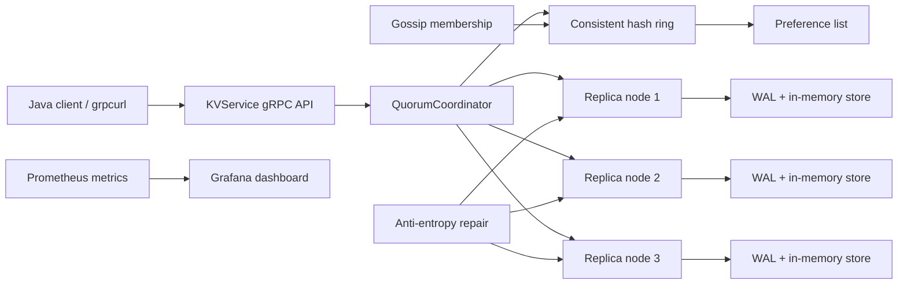
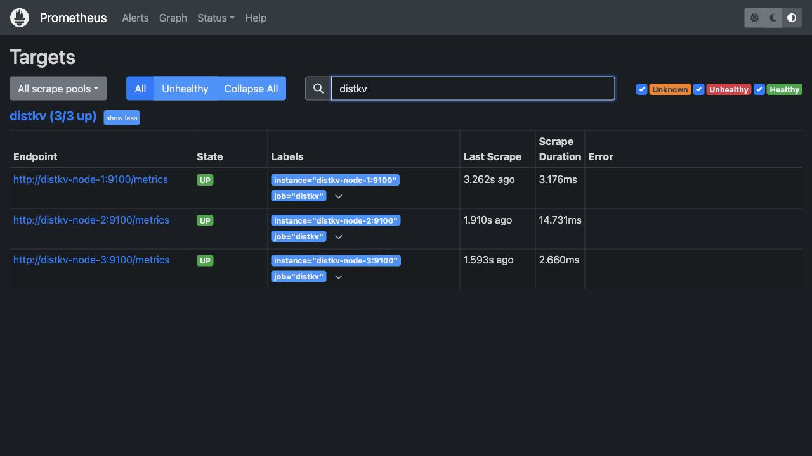
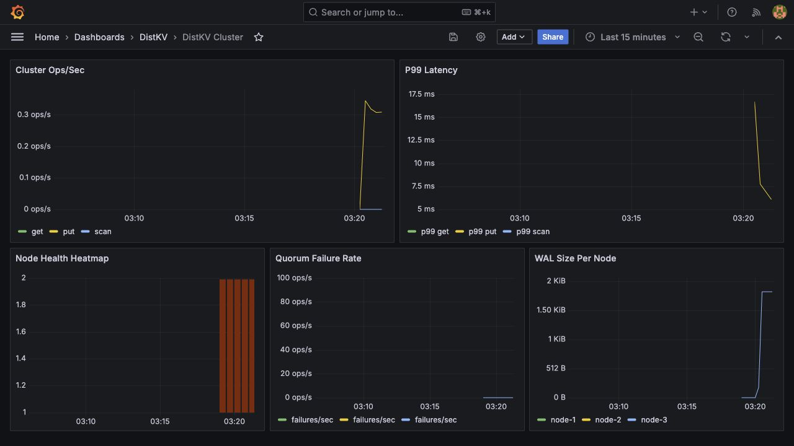

# DistKV - Distributed Key-Value Store

DistKV is a Java 21, gRPC, Dynamo-style distributed key-value store built as a resume-grade systems project. It demonstrates consistent hashing, quorum replication, vector clocks, hinted handoff, anti-entropy repair, WAL durability, gossip membership, Prometheus metrics, Grafana dashboards, Docker Compose deployment, and chaos testing.

## Stack

- Java 21
- gRPC + Protocol Buffers
- Netty via `grpc-netty-shaded`
- Maven
- Docker Compose
- Prometheus
- Grafana
- JUnit 5
- Mockito

## Architecture



Request flow:

1. A client calls `Put`, `Get`, `Delete`, or streaming `Scan`.
2. The coordinator hashes the key through the consistent hash ring.
3. The ring returns a preference list of replica nodes.
4. The coordinator sends replica RPCs in parallel.
5. The request succeeds when the configured consistency level has enough acknowledgements.
6. Storage appends to the WAL before mutating memory.
7. Gossip updates membership and removes dead nodes from the ring.
8. Hinted handoff and anti-entropy repair heal temporary replica failures and stale data.

## Implemented Features

### gRPC API Layer

- `KVService`
  - `Get(GetRequest)` with `ConsistencyLevel` (ONE/QUORUM/ALL)
  - `Put(PutRequest)` with `ConsistencyLevel`
  - `Delete(DeleteRequest)` with `ConsistencyLevel`
  - `Scan(ScanRequest) returns (stream Entry)` with `ConsistencyLevel` - **local reads only** (range queries stream from the contacted node)
- `ConsistencyLevel` enum: `ONE`, `QUORUM`, `ALL` is carried by all KV requests. Get/Put/Delete use it for quorum math; Scan carries it for API symmetry while streaming a local range.
- `AdminService`
  - `ClusterStatus`
  - `NodeJoin`
  - `NodeLeave`
- Internal `ReplicaService` for node-to-node replication, replica reads, version repair, Merkle comparison, and version fetches.
- Server-side streaming range scan so clients receive entries one at a time.

### Client Library

- `DistKvClient` wraps generated gRPC stubs behind a simple Java API.
- Builder API:
  - `addNode(...)`
  - `defaultConsistency(...)`
  - `maxRetries(...)`
  - `initialBackoff(...)`
  - `rpcTimeout(...)`
- Random healthy-node selection for each request.
- Retry with exponential backoff.
- Cluster-status refresh when a node fails.
- `scanStreaming(...)` exposes the server-side Scan stream as a Java `Iterator<Entry>`; `scan(...)` remains a list-collecting convenience method.

### Routing Layer

- MD5-based consistent hash ring.
- `TreeMap` ring traversal for `O(log n)` lookup.
- Configurable virtual nodes per physical node, defaulting to 150.
- Preference list lookup returns `N` distinct physical nodes clockwise around the ring.
- Coordinator pattern: the first node in the preference list coordinates Get/Put/Delete. If a client contacts another healthy node, that node forwards the request to the preference-list coordinator.

### Replication Layer

- Quorum writes: send to all `N` replicas in parallel and wait for `W` acknowledgements.
- Quorum reads: read from `R` replicas and return the newest visible value.
- `ONE`, `QUORUM`, and `ALL` map to different acknowledgement requirements.
- Vector clocks on every value: `{nodeId -> counter}`.
- Concurrent writes are retained as sibling versions instead of overwriting each other.
- Default read behavior returns latest visible value, while gRPC responses can include multiple versions for conflict visibility.
- Hinted handoff stores a missed replica write locally and retries delivery when that replica is reachable again.
- Anti-entropy repair periodically compares Merkle leaf hashes and syncs diverged keys between replicas.

### Storage Layer

- Thread-safe in-memory store backed by `ConcurrentHashMap`; gRPC request handlers run on Java 21 virtual threads.
- WAL durability: every put/delete is appended before memory is updated.
- Restart recovery by replaying WAL records.
- Snapshot compaction after a configurable number of writes to prevent unbounded WAL growth.
- Configurable LRU eviction using access-order tracking.
- LRU caps can be entry-based (`DISTKV_MAX_ENTRIES`) or approximate-memory-based (`DISTKV_MAX_MEMORY_BYTES`).
- Bloom filter checked before reads; a definite negative avoids the store lookup.
- Bloom filter math is documented below.

### Membership And Failure Detection

- Gossip-style membership model with heartbeat counters.
- Every cycle pings a small random fanout of peers.
- A node becomes `SUSPECT` after missed heartbeat cycles.
- A node becomes `DEAD` after sustained suspicion.
- Dead nodes are removed from the consistent hash ring, so new operations skip them.
- Admin API exposes cluster health for demos before and after killing a node.

### Observability

- Prometheus endpoint per node.
- Metrics include:
  - `distkv_ops_total{op}` for get/put/delete/scan counters; dashboard renders ops/sec with `rate(...)`.
  - `distkv_latency_seconds{op}` histogram for latency and P99 queries.
  - `distkv_quorum_failures_total`.
  - `distkv_replication_lag_ms{node_id}`.
  - `distkv_node_health{node_id}` gauge.
  - `distkv_wal_size_bytes{node_id}`.
  - `distkv_pending_hints{node_id}`.
- Grafana dashboard JSON in `deploy/grafana-dashboard.json`.
- Grafana provisioning in `deploy/grafana/provisioning` auto-loads the Prometheus datasource and DistKV dashboard in Docker Compose.
- Five dashboard panels:
  - Cluster ops/sec
  - P99 latency
  - Node health heatmap
  - Quorum failure rate
  - WAL size per node

### Testing And Chaos

- Unit tests cover:
  - Consistent hash ring distribution.
  - WAL replay correctness.
  - Bloom filter false-positive rate.
  - Quorum `R + W > N` combinations.
  - Vector-clock conflict siblings.
  - LRU eviction.
  - WAL snapshot compaction and recovery.
  - Hinted handoff delivery.
  - Merkle divergence detection.
- Chaos demo in `test/chaos` kills a node during a write burst and verifies quorum behavior with two of three replicas alive.

## Build And Test

```bash
mvn test
```

Build the runnable shaded jar:

```bash
mvn -DskipTests package
```

Run one local node:

```bash
java -jar target/distkv-0.1.0-SNAPSHOT.jar
```

Or run through Maven:

```bash
mvn exec:java
```

Run the built-in Java demo client against three local nodes:

```bash
java -cp target/distkv-0.1.0-SNAPSHOT.jar com.distkv.client.DistKvDemoClient smoke
java -cp target/distkv-0.1.0-SNAPSHOT.jar com.distkv.client.DistKvDemoClient cluster
java -cp target/distkv-0.1.0-SNAPSHOT.jar com.distkv.client.DistKvDemoClient get chaos-after-25
```

The demo client also has a local replica check for repair demos:

```bash
java -cp target/distkv-0.1.0-SNAPSHOT.jar com.distkv.client.DistKvDemoClient replica-read localhost 50053 chaos-after-25
```

## Local Configuration

Useful environment variables:

| Variable | Default | Meaning |
| --- | --- | --- |
| `DISTKV_NODE_ID` | `node-1` | Logical node id |
| `DISTKV_HOST` | `localhost` | Host advertised to other nodes |
| `DISTKV_PORT` | `50051` | gRPC API port |
| `DISTKV_METRICS_PORT` | `9100` | Prometheus scrape port |
| `DISTKV_REPLICATION_FACTOR` | `3` | Number of replicas per key |
| `DISTKV_DATA_DIR` | `data/<nodeId>` | WAL and snapshot directory |
| `DISTKV_PEERS` | empty | Comma-separated `nodeId:host:port` peers |
| `DISTKV_MAX_ENTRIES` | `-1` | LRU cap; negative means unbounded |
| `DISTKV_MAX_MEMORY_BYTES` | `-1` | Approximate LRU memory cap; negative means unbounded |
| `DISTKV_BLOOM_EXPECTED_INSERTIONS` | `100000` | Bloom filter expected key count |
| `DISTKV_BLOOM_FALSE_POSITIVE_RATE` | `0.01` | Bloom filter false-positive probability |
| `DISTKV_WAL_COMPACTION_WRITES` | `10000` | Snapshot/compact interval |
| `DISTKV_ANTI_ENTROPY_INTERVAL_SECONDS` | `30` | Replica repair interval |

Example three-node local peer value:

```bash
DISTKV_PEERS=node-2:localhost:50052,node-3:localhost:50053
```

## Docker Compose Demo

Start a three-node cluster plus Prometheus and Grafana:

```bash
cd deploy
docker compose up --build -d
```

Services:

- Node 1 gRPC: `localhost:50051`, metrics: `localhost:9101`
- Node 2 gRPC: `localhost:50052`, metrics: `localhost:9102`
- Node 3 gRPC: `localhost:50053`, metrics: `localhost:9103`
- Prometheus: `http://localhost:9090`
- Grafana: `http://localhost:3000` with `admin` / `admin`

Grafana auto-provisions Prometheus and the DistKV dashboard. The dashboard JSON is also available at `deploy/grafana-dashboard.json` if you want to inspect or import it manually.

After startup, Prometheus should show all three DistKV scrape targets as healthy:



The Grafana dashboard should show cluster operations, latency, node health, quorum failures, and WAL size:



Bring everything down:

```bash
cd deploy
docker compose down -v
```

## grpcurl Examples

Put a value. The `value` field is bytes, so JSON uses base64:

```bash
grpcurl -plaintext \
  -d '{"key":"hello","value":"d29ybGQ=","consistency":"QUORUM"}' \
  localhost:50051 distkv.api.KVService/Put
```

Read it back:

```bash
grpcurl -plaintext \
  -d '{"key":"hello","consistency":"QUORUM"}' \
  localhost:50051 distkv.api.KVService/Get
```

Stream a range scan (always local read from contacted node):

```bash
grpcurl -plaintext \
  -d '{"startKey":"a","endKey":"z","consistency":"ONE"}' \
  localhost:50051 distkv.api.KVService/Scan
```

Show cluster status:

```bash
grpcurl -plaintext \
  -d '{}' \
  localhost:50051 distkv.api.AdminService/ClusterStatus
```

## Chaos Test

Prerequisites:

- Docker and Docker Compose
- `grpcurl` is optional. If it is not installed locally, the script uses the `fullstorydev/grpcurl` Docker image on the Compose network.

Run:

```bash
cd deploy
docker compose up --build -d
cd ..
./test/chaos/chaos-quorum.sh
```

The script writes through node 1, stops node 3 mid-burst, continues writing with `QUORUM`, and reads a key back while only two of three nodes are alive.

## Bloom Filter Math

For expected insertions `n` and false-positive probability `p`:

```text
m = ceil(-(n * ln(p)) / (ln(2)^2))
k = round((m / n) * ln(2))
```

Where:

- `m` is the number of bits.
- `k` is the number of hash functions.
- `p` defaults to `0.01`.

For `n = 100000` and `p = 0.01`, the filter uses about `958506` bits and `7` hash functions.

## Interview Talking Points

- DistKV uses consistent hashing so adding/removing nodes only remaps part of the keyspace.
- Quorum consistency works because `R + W > N` guarantees read/write overlap.
- Vector clocks detect concurrent writes that cannot be safely ordered by timestamp alone.
- WAL guarantees durability by recording mutations before applying them to memory.
- Hinted handoff handles short outages; anti-entropy handles longer divergence.
- Gossip avoids a single centralized membership service.
- Prometheus and Grafana make the system observable under load and during failures.
